Summary
===============================

llm-rag-assistant is a fully local, retrieval-augmented chatbot powered by llama-cpp-python, designed to answer questions in Spanish using your own Q&A dataset. It uses semantic search via FAISS + multilingual sentence-transformers to retrieve relevant answers, and combines it with a local instruction-tuned LLM (e.g., Mistral-7B-Instruct in GGUF format) for contextual response generation.

## 🚀 Features

- 🔍 Semantic Search with multilingual embeddings (sentence-transformers)
- 🧠 Local LLM inference without a GPU using optimized GGUF models + llama-cpp-python
- 💻 Runs on standard laptops and desktops — no CUDA, no GPU, no special hardware required
- 🔒 No API keys, no cloud dependency — fully private and offline
- 🗂️ Plug-and-play with any Q&A dataset in JSON format

RAG Local - Instrucciones
===============================

Este paquete te permite correr un chatbot de consola con recuperación semántica (RAG) en tu máquina, sin necesidad de GPU ni conexión externa.

Esta versión funciona en consola. Para usar con interfaz, ver streamit version

Requisitos:
-----------
1. Python 3.9+
2. Instalar dependencias:
   pip install llama-cpp-python faiss-cpu sentence-transformers

Probado con python-3.13.5, versiones específicas en environment.yml 
    # En mac os, si falla el build probar 
    conda install -c conda-forge llama-cpp-python 
    pip install faiss-cpu sentence-transformers

3. Descargar el modelo GGUF:

Por ejemplo
```bash
   wget https://huggingface.co/TheBloke/Mistral-7B-Instruct-v0.1-GGUF/resolve/main/mistral-7b-instruct-v0.1.Q4_K_M.gguf -O mistral-7b-instruct.Q4_K_M.gguf
```

Por motivos de seguridad. Validar integridad comparando el resultado del sha256 del archivo descargado, con el que figura en https://huggingface.co/TheBloke/Mistral-7B-Instruct-v0.1-GGUF/blob/main/mistral-7b-instruct-v0.1.Q4_K_M.gguf

```bash
  sha256 mistral-7b-instruct.Q4_K_M.gguf 
```

  Modelo open source, licencia apache 2.0
  https://huggingface.co/mistralai/Mistral-7B-Instruct-v0.1

4. Construir dataset de preguntas y respuestas

Importante: Guardar en el archivo qa_dataset.json

Debe tener la siguiente estructura (ejemplo)
```json
[
  {
    "pregunta": "¿Cuál es el horario de atención?",
    "respuesta": "Nuestro horario de atención es de lunes a viernes de 9:00 a 18:00 horas y sábados de 9:00 a 14:00."
  },
  {
    "pregunta": "¿Cómo puedo contactar con soporte técnico?",
    "respuesta": "Puede contactar con soporte técnico a través del email soporte@empresa.com, llamando al 900-123-456 o mediante el chat en vivo de nuestra web."
  },
  ...
]
```

5. Armar archivo config.yaml configuración del Sistema RAG

Por ejemplo

```bash
models:
  embeddings:
    model_name: "sentence-transformers/paraphrase-multilingual-MiniLM-L12-v2"
  generation:
    llama_cpp_model_path: "models/mistral-7b-instruct.Q4_K_M.gguf"
    smax_tokens: 256
```

*Nota:* para que funcione con este tipo de dataset de preguntas y respuestas, debe ser un modelo tipo instruct

TODO:
-----
* Agregar configuración de temperature

## 🧠 Arquitectura del sistema

Este es el flujo general del sistema RAG local:



Archivos incluidos:
-------------------
- prepare_embeddings.py → genera dataset_index.faiss y qa.json a partir de tu dataset
- chatbot_rag_local.py  → ejecuta el chatbot de consola usando llama-cpp
- qa_dataset.json → tu base de conocimiento

Pasos:
------
1. Ejecutá: python prepare_embeddings.py
2. Ejecutá: python chatbot_rag_local.py
3. Chateá con tu base de conocimiento usando un bot en español :)

## 📊 Evaluación y Métricas de Calidad

### Scripts de Evaluación Disponibles

#### 📈 Evaluación con BERTScore
Para evaluar la calidad semántica de las respuestas del sistema RAG:

```bash
# 1. Generar respuestas
python model_evaluation.py

# 2. Solo calcular BERTScore de respuestas ya generadas
python model_evaluation.py bertscore
```

**Salida**: 
- `evaluation_results.json` - Pares pregunta-respuesta generados
- `bertscore_results.json` - Métricas BERTScore detalladas

#### 📊 Calcular Métricas desde Archivo Existente
Si ya tienes un archivo con respuestas generadas:

```bash
# Calcular todas las métricas desde evaluation_results.json
python calculate_metrics_from_json.py

# O desde cualquier archivo JSON específico
python calculate_metrics_from_json.py mi_archivo_evaluacion.json
```

### 📋 Dependencias para Evaluación

```bash
# Instalar métricas de evaluación
pip install bert-score rouge-score nltk scikit-learn
```

### 🎯 Interpretación de Métricas

#### BERTScore (Similitud Semántica)
- **F1 > 0.85**: ⭐ Excelente - Listo para producción
- **F1 0.70-0.85**: ✅ Bueno - Uso académico confiable  
- **F1 0.50-0.70**: ⚠️ Básico - Requiere mejoras
- **F1 < 0.50**: ❌ Problemático - Revisar sistema

#### ROUGE (N-gramas)
- **ROUGE-1**: Coincidencia de palabras individuales
- **ROUGE-2**: Coincidencia de pares de palabras  
- **ROUGE-L**: Secuencias largas coincidentes

#### BLEU (Precisión)
- **BLEU-4**: Precisión de 4-gramas (más estricto)
- Valores típicos: 0.2-0.6 para generación natural

### 🔧 Configuración de Evaluación

Para personalizar la evaluación, edita los parámetros en los scripts:

```python
# Número de muestras a evaluar
n_samples = 15  # Cambiar según necesidad

# Seed para reproducibilidad
random.seed(42)

# Idioma para BERTScore
lang="es"  # Español por defecto
```

### 📊 Ejemplo de Salida

```
📊 BERTScore (Similitud Semántica):
   Precision: 0.7724 ± 0.0879
   Recall:    0.8905 ± 0.0591  
   F1-Score:  0.8265 ± 0.0732
   Calidad:   ⭐ MUY BUENO

📝 ROUGE (N-gramas y Secuencias):
   ROUGE-1:   0.5064 ± 0.2007
   ROUGE-2:   0.4026 ± 0.2220
   ROUGE-L:   0.4760 ± 0.2138
```

Requisitos:
-----------
- 8GB RAM mínimo (16GB recomendado)
- ~5GB de espacio para los modelos